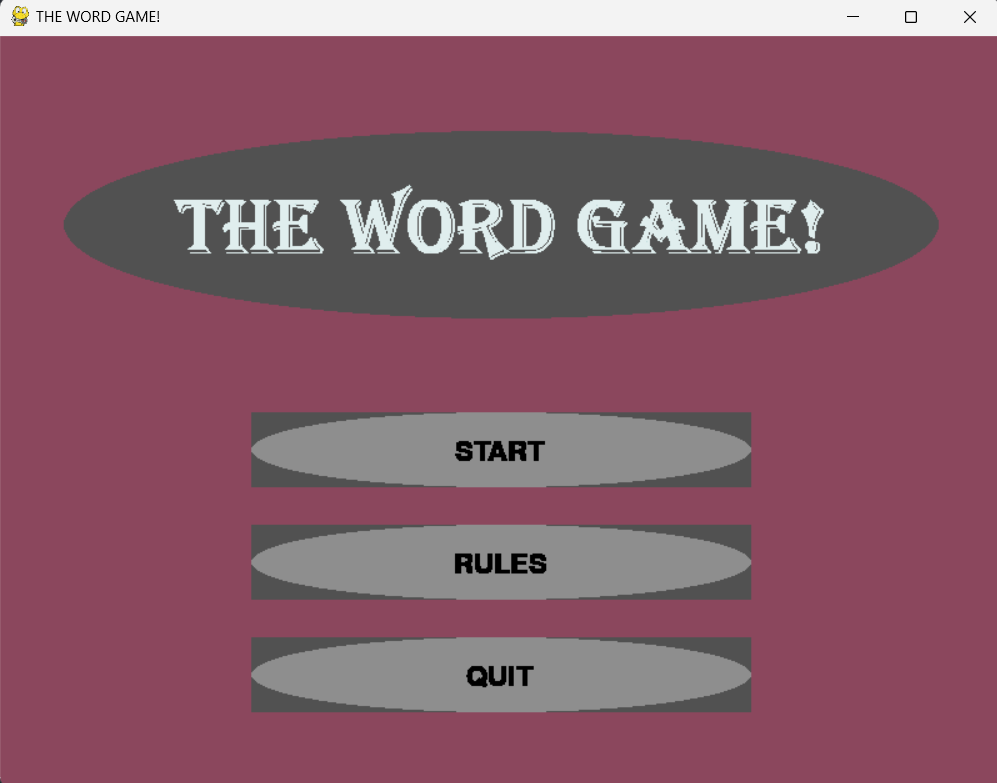
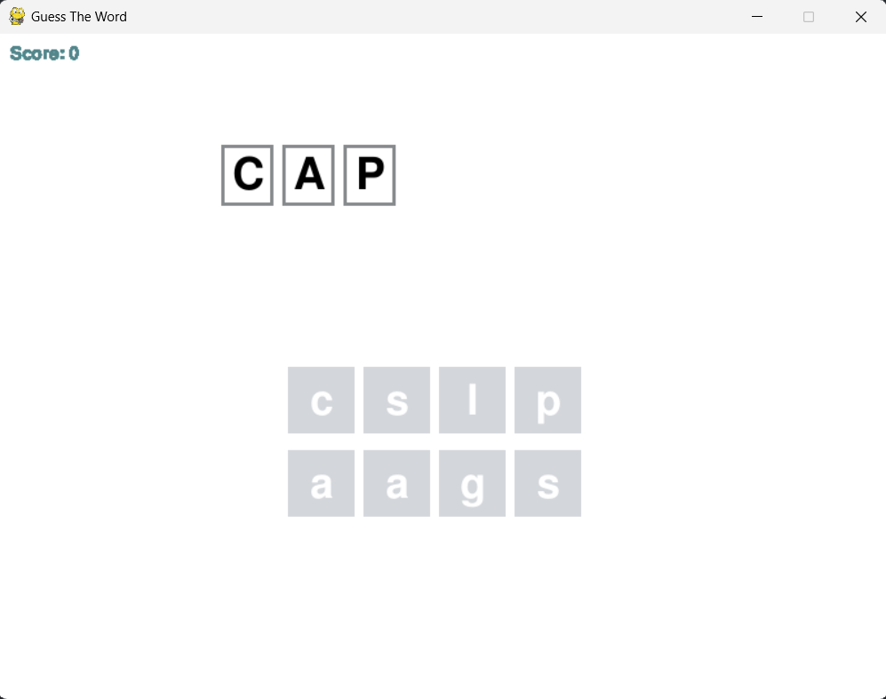

# The Word Game

## Introduction
This is a game inspired by the popular game [Wordle](https://www.nytimes.com/games/wordle/index.html). The game is built using the Weak AVL tree data structure and `pygame` library in python. The game is built as a part of the course CS 201 Data Structures II at Habib University, Karachi.

## The Game
### Brief
The game is a single player game where the player has to make as many words as possible from a given set of letters. Each valid word rewards 5 points. The player has to maximize their score.

### Rules
- The player can only use the letters given to them.
- The player can use a letter only as many times as it appears in the given set of letters.
- The player can only use words that are present in the dictionary.
- The player can only use words that are at least 3 letters long.
- The player cannot use duplicate words.

### Controls
- The player can use the keyboard to type in the words.

### Game Snapshots

## WAVL Tree
The underlying data structure upon which the entire game was designed was the Weak AVL Tree. The tree was used to store the dictionary of words. The tree was built using the following properties:
- Every node has a rank.
- Every node has a key.
- Every node has a right child, left child and a parent.

The tree was built using the following functions:
- `insert(key)` - Inserts a node with the given key into the tree.
- `remove(key)` - Removes the node with the given key from the tree.
- `search(key)` - Searches for the node with the given key in the tree.
- `height(node)` - Returns the height of the node.
- `rank_diffs(node)` - Returns the rank difference between the left and right child of every node in the tree.
- `promote(node)` - Promotes the node to the next rank if the rank difference is 1.
- `demote(node)` - Demotes the node to the previous rank if the rank difference is 2.
- `rotate_left(node)` - Performs a left rotation on the node.
- `rotate_right(node)` - Performs a right rotation on the node.
- `insert_rebalance(node)` - Rebalances the tree after an insertion.
- `deletion_rebalance(node, parent)` - Rebalances the tree after a removal.
- `transplant(node1, node2)` - Transplants node1 with node2.
- `inorder()` - Performs an inorder traversal of the tree.

## Dictionary
The dictionary used in the game was the `nltk` corpus. The corpus was filtered to only include words that were at least 3 letters long. The corpus was then converted into a list of words and inserted into the WAVL tree.

## Acknowledgements

- [Rank-Balanced Trees - B Haeupler, S Sen, R Tarjan](https://link.springer.com/chapter/10.1007/978-3-642-03367-4_31)
- [Weak AVL Trees - M. T. Goodrich and R. Tamassia](https://ics.uci.edu/~goodrich/teach/cs165/notes/WeakAVLTrees.pdf)
- [Dr. Waqar Saleem](https://github.com/waqarsaleem)